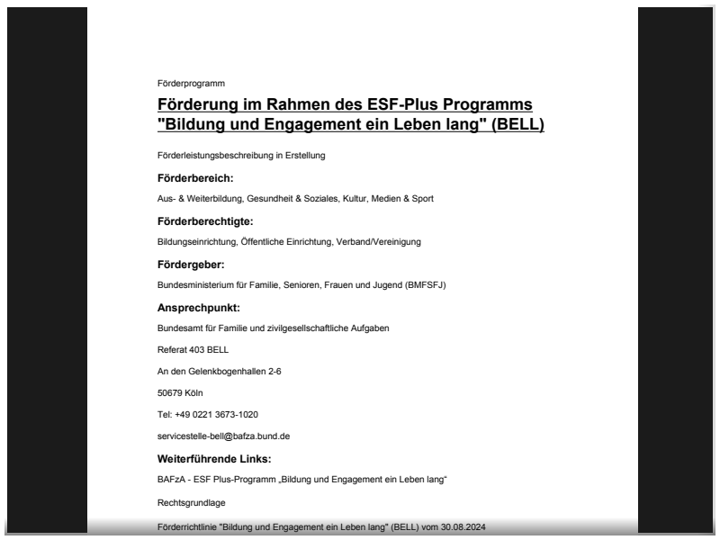
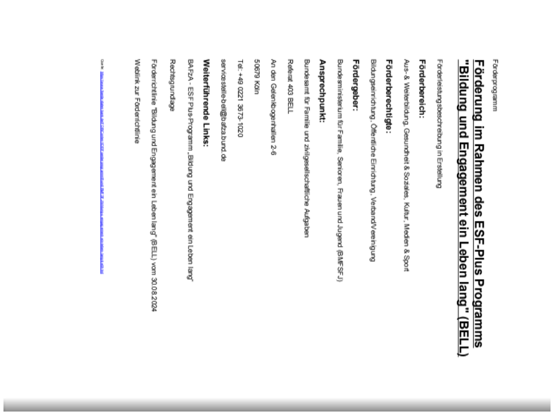
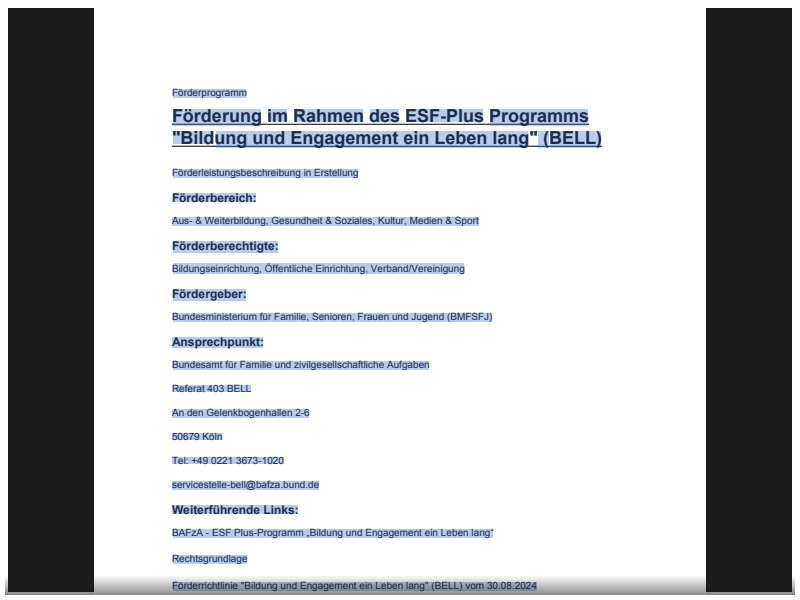
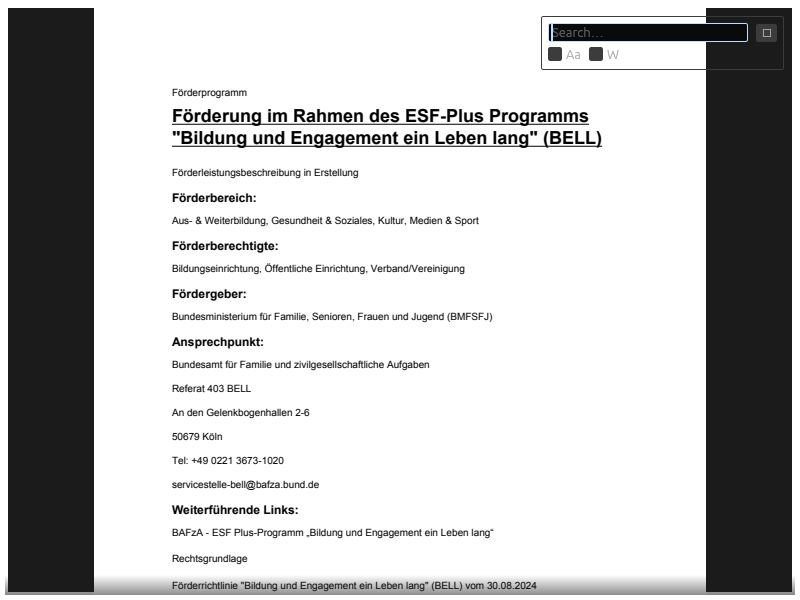

# viewkai

viewkai is a Rust PDF viewer library targeting `wasm32-unknown-unknown` and native dev platforms, built on pdfium-render and egui.

## Stack

- Rust
- egui
- pdfium-render
- WASM / `wasm32-unknown-unknown`

## Status

- Current release: `v0.2.0`
- Plugin architecture powers text extraction, selection, search, outline, and thumbnails
- Native and web apps now ship matching application-shell menus and viewing controls

## Features

- Document outline (PDF bookmarks / table of contents)
- Page thumbnails sidebar
- Single, Continuous, Spread viewing modes
- Display-time page rotation (non-destructive)
- Native and web application shells with File/View/Help menus
- Text extraction, selection, copy, and full-text search

## Repository layout

- `crates/viewkai-core` — core types and errors
- `crates/viewkai-engine` — PDFium integration boundary
- `crates/viewkai-plugins` — sealed built-in plugin abstraction (`TextLayerPlugin`, `SearchPlugin`)
- `crates/viewkai` — embeddable viewer library surface
- `crates/viewkai-app` — native PDF viewer application
- `crates/viewkai-web` — WASM web demo (renamed out of the old combined demo crate)

## Architecture

`viewkai` owns a fixed-order built-in plugin registry exposed through the sibling `viewkai-plugins` crate. In `v0.1.0`, the sealed `TextLayerPlugin` and `SearchPlugin` now ship as built-in functionality for text extraction, text selection, clipboard copy, and full-text search across the viewer's three contribution surfaces: per-page overlays, toolbar UI, and viewer-level overlays.

## Docs

- [Keyboard shortcuts](docs/shortcuts.md)

## Screenshots

### Outline Sidebar (v0.2.0)

### Thumbnails Sidebar (v0.2.0)

### Rotation (v0.2.0)

### Text Selection (v0.1.0)

### Search (v0.1.0)

